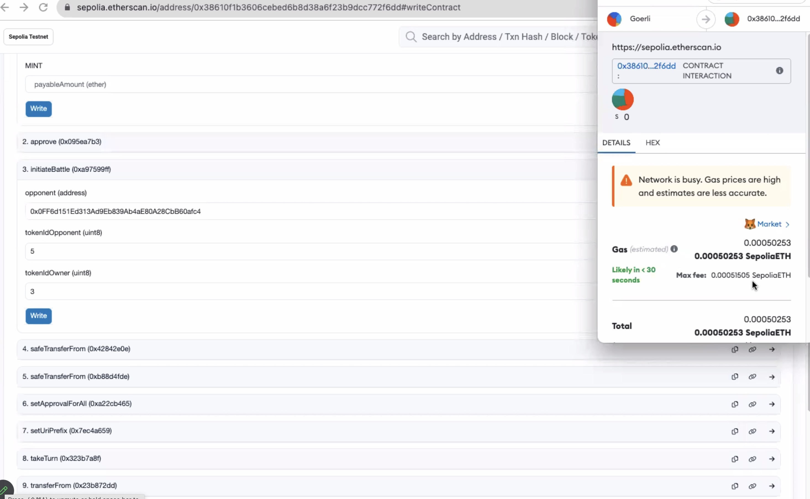
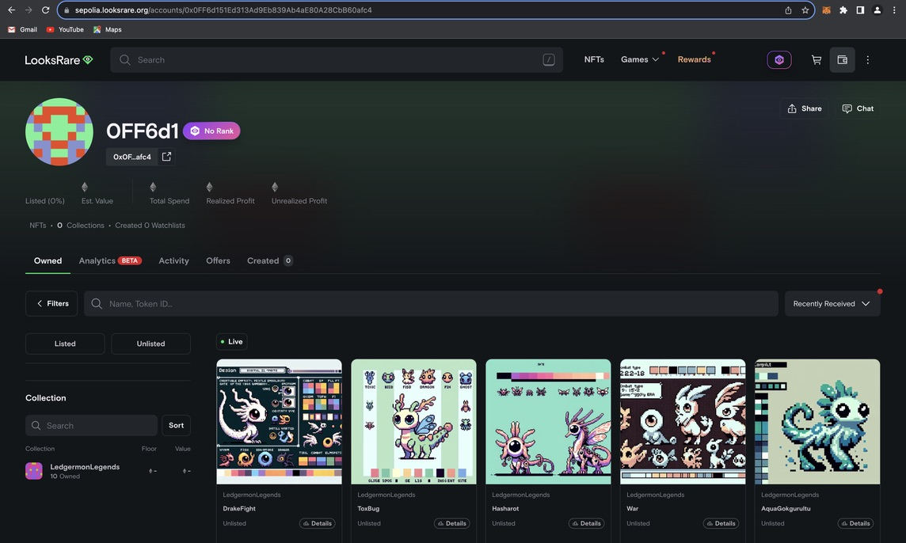

# Fintech Bootcamp Capstone Project:
# Project 3 - Ledgermon Lair

# NFT and Sprite Metadata Creation
## Libraries Used

- `random`: Essential for generating random selections and attributes.
- `requests`: Used for making HTTP requests to fetch images.
- `IPython.display`: Ideal for displaying images in Jupyter notebook environments.
- `openai`: Integrates with OpenAI's API for image generation.
- `os`: Handles directory and file operations.
- `dotenv`: Loads environment variables from a `.env` file.
- `json`: Manages JSON data for reading and writing purposes.

# NFT Smart Contract Creation
## Libraries Used
- 'pragma solidity ^0.8.20'
- 'ERC-721': Ethereum token standard
- 'Ownable': Contract module which provides a basic access control mechanism, where there is an account (an owner) that can be granted exclusive access to specific functions.

## Workflow Summary
# NFT Smart Contract Creation
- collect all Metadata and create NFT pictures
- create IPFS_locationto be linked with contracts and front-end
- create both contracts (Ledgermon and LedgermonBattle)
- compile them and deploy
- test the networks on the OpenSea testnet
- create front-end-GUI

### Environment Setup
- Environment variables are loaded, focusing on the OpenAI API key.

# NFT Smart Contract Creation
### Environment Setup
- pragma solidity ^0.8.20;
- import "@openzeppelin/contracts/token/ERC721/ERC721.sol";

### Defining Game Elements
- Lists of common and rare items are established.
- A mapping system links various types to syllables for generating character names.

### Metadata Generation
- Metadata generation: A function generates metadata for each game character, including types, attributes, and unique names.

### Sprite Generation and File Handling
- The OpenAI client is initialized, and a sprites directory is prepared.
- Sprites are generated using OpenAI's API based on character types, then saved locally.
- Metadata files are updated with new sprite filenames and IPFS links.
- Finalized metadata is saved, and individual JSON files for each character are created.

## Key Features
- Dynamic generation of character names and attributes.
- Use of OpenAI's image generation API for creating unique character sprites.
- Integration with IPFS, indicating blockchain or distributed ledger technology utilization.

# NFT Smart Contract Creation
### Defining Game Elements
- construct LedgermonLegend to inherit ERC721 : standard defines a set of functions that allow for the creation, ownership, and transfer of NFTs. Each NFT is represented by a unique identifier, and can have associated metadata, such as a name, description, and image.
- set :
    using Strings for uint256;
    uint256 private _nextTokenId = 1; //start at
    uint256 public cost = 0.00001 ether;
    string public uriSuffix = ".json";
    string public uriPrefix = "IPFS link"
- set the tokenUri to be linked with the tokenId
- call the function on tokenURI, which contains tokenId, uriPrefix and uriSuffix
- generate minting function to create a tokenId and also setting the cost of minting
##### Battle Constructor:
- create struct to generate all variables in the Battle, the Struct represents a battle such as battleId, player1's address, player2's address so on.
   struct Battle {
        uint256 battleId;
        address player1;
        address player2;
        PokemonAttributes player1Pokemon;
        PokemonAttributes player2Pokemon;
        BattleState state;
        address turn;
        address winner;
        uint256 opponentPokemonId; // New member to store the opponent's Pokemon ID
    }
- Mapping to store battles by their battleId
- Generate Event emitted when a battle is initiated
- Call Function initiateBattle from address opponent, uint8 tokenIdOpponent, uint8 tokenIdOwner *** require an ownerOf statement
- Initialize player1 and player2 Pokemon attributes
- Call Function takeTurn(uint256 battleId), which is the battle beginning state
- Setting the condition of the battle by creating If-else statement
- generating the return of the winner address 
- remitting the emit function to notify the turntaken and the end of battle
## Key Features
### Verify the LedgermonBattle contract on Etherscan
- Entering the flatten code from Solidity into Etherscan web page
- Then Verify and Publish the code in order to let the external network can participate in the battle game

# Front-end-GUI

# Project Disclaimer
## Educational Purpose

This project was developed as part of the EdX FinTech Bootcamp presented by Monash University. It serves as a capstone project, embodying the culmination of learning and skills acquired throughout the course. The primary objective of this project was to integrate and apply knowledge in the fields of Artificial Intelligence, Blockchain, and Python programming, along with other tools and techniques learned during the Bootcamp.

## Scope of Use
The content and code within this project are intended solely for educational purposes. They demonstrate the practical application of cutting-edge technologies in a controlled learning environment. This project is an academic exercise and is not intended for commercial use. It will not be formally deployed in any commercial or public capacity.
The project serves as a testament to the learning journey undertaken in the Bootcamp and showcases the potential of combining AI and blockchain technologies in creative ways, using Python as the foundational programming language.
