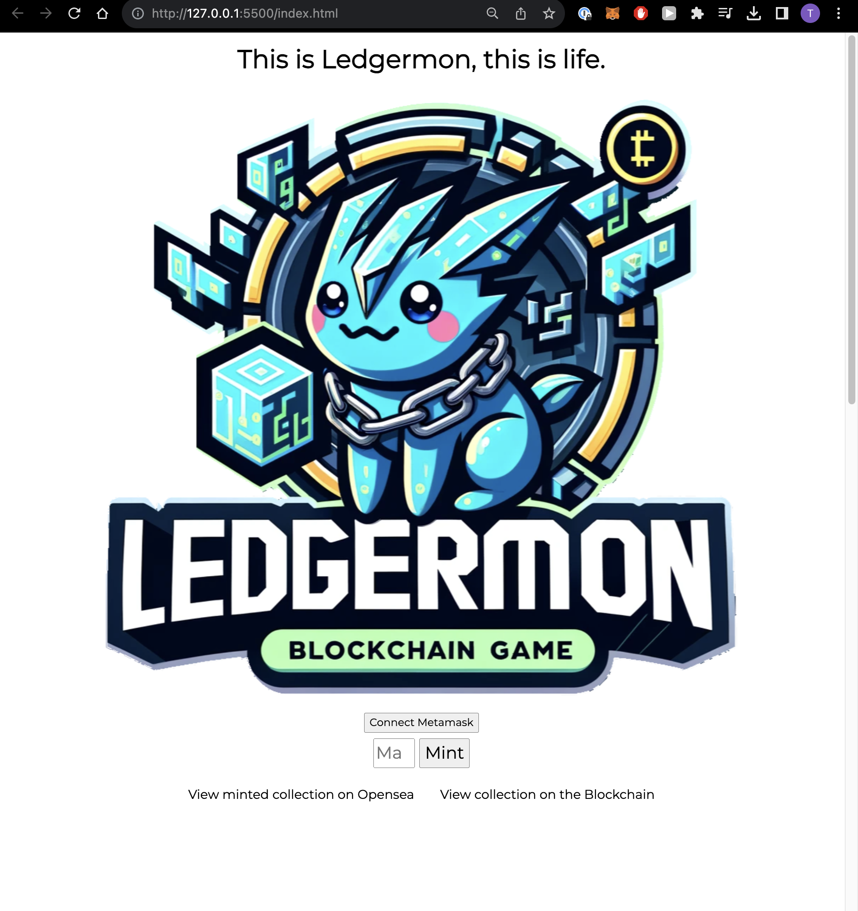

# Fintech Bootcamp Capstone Project:
# Project 3 - Ledgermon Lair

# NFT and Sprite Metadata Creation
## Libraries Used

- `random`: Essential for generating random selections and attributes.
- `requests`: Used for making HTTP requests to fetch images.
- `IPython.display`: Ideal for displaying images in Jupyter notebook environments.
- `openai`: Integrates with OpenAI's API for image generation.
- `os`: Handles directory and file operations.
- `dotenv`: Loads environment variables from a `.env` file.
- `json`: Manages JSON data for reading and writing purposes.
- 'pragma solidity ^0.8.20'
- 'ERC-721': Ethereum token standard
- 'Ownable': Contract module which provides a basic access control mechanism, where there is an account (an owner) that can be granted exclusive access to specific functions.

## Workflow Summary

### Environment Setup
- Environment variables are loaded, focusing on the OpenAI API key.

### Defining Game Elements
- Lists of common and rare items are established.
- A mapping system links various types to syllables for generating character names.

### Metadata Generation
- Metadata generation: A function generates metadata for each game character, including types, attributes, and unique names.

### Sprite Generation and File Handling
- The OpenAI client is initialized, and a sprites directory is prepared.
- Sprites are generated using OpenAI's API based on character types, then saved locally.
- Metadata files are updated with new sprite filenames and IPFS links.
- Finalized metadata is saved, and individual JSON files for each character are created.

## Key Features
- Dynamic generation of character names and attributes.
- Use of OpenAI's image generation API for creating unique character sprites.
- Integration with IPFS, indicating blockchain or distributed ledger technology utilization.

# Project Disclaimer
## Educational Purpose

This project was developed as part of the EdX FinTech Bootcamp presented by Monash University. It serves as a capstone project, embodying the culmination of learning and skills acquired throughout the course. The primary objective of this project was to integrate and apply knowledge in the fields of Artificial Intelligence, Blockchain, and Python programming, along with other tools and techniques learned during the Bootcamp.

## Scope of Use
The content and code within this project are intended solely for educational purposes. They demonstrate the practical application of cutting-edge technologies in a controlled learning environment. This project is an academic exercise and is not intended for commercial use. It will not be formally deployed in any commercial or public capacity.
The project serves as a testament to the learning journey undertaken in the Bootcamp and showcases the potential of combining AI and blockchain technologies in creative ways, using Python as the foundational programming language.
